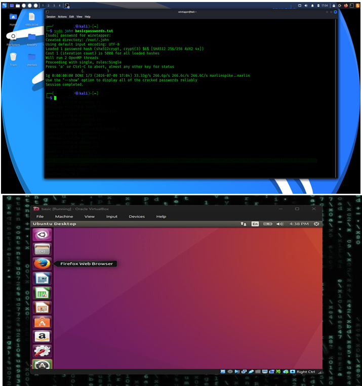

# Linux Penetration Testing Lab

## Project Overview
This project documents my process of scanning a target system, identifying vulnerabilities, and gaining root access.

### 1. Network Reconnaissance

### 2. Vulnerability Research

### 3. Exploitation & Root Access

### Methodology
* **Network Reconnaissance**: I used `nmap` to discover open services including ProFTPD 1.3.3c.
* **Vulnerability Research**: I utilized `searchsploit` to identify a specific remote code execution backdoor.
* **Exploitation**: I used Metasploit to successfully exploit the service and confirm root-level access with `whoami`.

### Security & Privacy
* Sensitive system outputs (like /etc/shadow hashes) have been redacted from these images to demonstrate professional data privacy practices.
